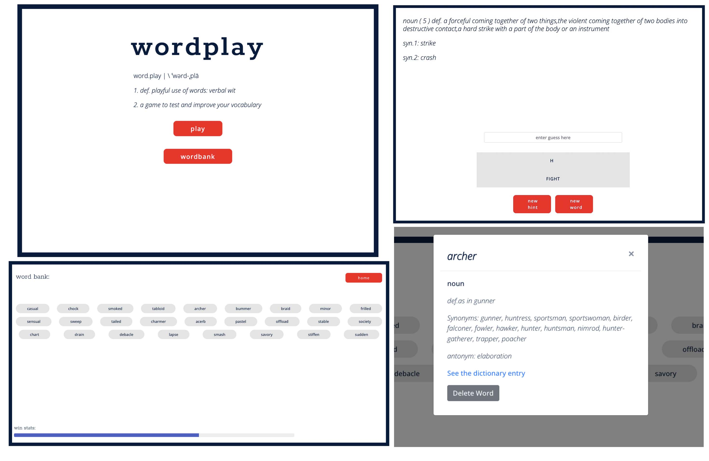

# wordplay - the game

## About This Project
Wordplay is the word-game that tests your vocabulary, not luck.

In this word guessing game, players guess randomly generated words with clues based on that words entry in the Merriam-Webster Thesaurus. Random words are limited to  5-7 characters long, and with a sufficient thesaurus entry. The round ends when the word is correctly guessed or the hints/guesses run out. 

### How to Play:
Players get 5 guesses - and 5 hints, which include:
- Word Definition
- 2 Synonyms
- The first and last letter of the word

At each turn, the player types in their guess. Correct letters, and guessed words are stored in the letterbank below the playing area. Once the round is over, played words are stored in the players wordbank using local storage so they can always go back and see the words they’ve learnt. A win stats bar shows the ratio of wins to losses so players can track their progress.

## Technologies Used:
1. Coding languages: 
- HTML
- CSS
- JavaScript
2. Third-Party-APIs: 
- Google fonts
- Bootstrap
- jQuery
- Bulma
3. Server-Side-APIs: 
 - [Merriam-Webster Thesaurus API](https://dictionaryapi.com/products/api-collegiate-thesaurus)
 - [API-ninjas](https://api-ninjas.com/api/randomword)

## Usage

## Link:
- [GitHub Repo](https://github.com/AmyWilford/Word-Play)
- [Deployed GitHub page](https://amywilford.github.io/Word-Play/)

## Installation
N/A

## Credits
Coded in collaboration with Saharsh Cherian, Kaye Xie, and Amy Wilford.

## License
N/A